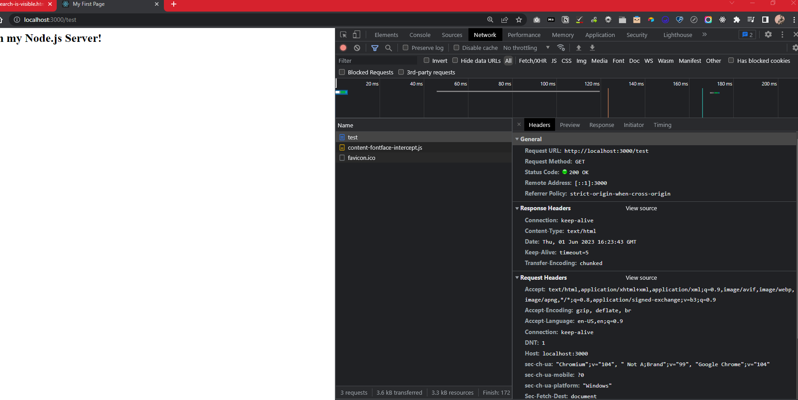

# NodeJS

> Remove node modules:

```bash
find . -name 'node_modules' -type d -prune -exec rm -rf '{}' +
```

**Main Core Modules**

- http - create a web server, send requests, etc.
- https - create a secure web server, send requests, etc.
- fs - file system, read/write files, etc.
- path - path to files, etc.
- os - operating system, etc.
  **http.createServer()** - create a web server

```js
const http = require("http");
const server = http.createServer((req, res) => {
  console.log(req);
});
```

**server.listen()** - listen to a port

```js
const http = require("http");
const server = http.createServer((req, res) => {
  console.log(req);
});
server.listen(3000);
```

- the server.listen() method takes a port number as an argument and will keep the server running while it listens for requests on that port number.

  **Node.js Program Lifecycle**

- Node.js is a single-threaded application, but it can support concurrency via the concept of event and callbacks.
- the **Event Loop** is a single thread that performs all I/O operations asynchronously.

- The function we pass to createServer is an event listener, and the server object will emit events when a request is made, but it will not execute the event listener function right away. Instead, it will wait for the event loop to be free, and then it will execute the event listener function.

  `process.exit();` - exit the event loop... this is not recommended, but it is possible, and will terminate the program.

  `response.setHeader( "Content-Type", "text/html" );` - set the header of the response, this represents the type of data that is being sent back to the client.

  `response.write( "<h2> Hello </h2>" );` - write data to the response, this is the data that will be sent back to the client.

  `response.end();` - end the response, this will send the response back to the client.
  **Complete Code To Send Basic HTML to Client**

```js
const http = require("http");
const server = http.createServer((request, response) => {
  console.log(request.url, request.method, request.headers);
  response.setHeader("Content-Type", "text/html");
  response.write("<html>");
  response.write("<head><title>My First Page</title></head>");
  response.write("<body><h1>Hello from my Node.js Server!</h1></body>");
  response.write("</html>");
  response.end();
});
server.listen(3000);
```

> Shortcut to open developer tools in Chrome: `Ctrl + Shift + I`
> How to view the request in the network tab of the developer tools in Chrome:
> 

- as you can see there are some default headers set by the browser in addition to the headers we set in our code.

- If we view the response we see the response body is

```html
<html>
  <head>
    <title>My First Page</title>
  </head>
  <body>
    <h1>Hello from my Node.js Server!</h1>
  </body>
</html>
```

[Available Headers](https://developer.mozilla.org/en-US/docs/Web/HTTP/Headers)
**GET Requests** - GET requests are the most common type of request, and they are used to fetch data from a server.

**POST Requests** - POST requests are used to send data to a server.

**PUT Requests** - PUT requests are used to send data to a server to create or update a resource.

**DELETE Requests** - DELETE requests are used to delete a resource from a server.

**PATCH Requests** - PATCH requests are used to update a resource.

**OPTIONS Requests** - OPTIONS requests are used to fetch information about a server.

> In the example below:

```js
response.write(
  "<body><form action='/message' method='POST'><input type='text' name='message'></input><button type='submit></button></form></body>",
);
```

- The `name` set on the input does not have to be `message` , it will add any input data to the request and make it accessible via the assigned name.
- the form action is set to `/message` which means that when the form is submitted, the data will be sent to the `/message` route.

##### Streams & Buffers

- Streams are a way to read data from a source or write data to a destination in a continuous fashion, they break the data up into chuncks so we can start operating on some of the data while the rest is still streaming in.
- Buffers are a way to temporarily store data in a stream.
- Streams are used to read or write data in chunks, and they are used to handle large amounts of data in a memory-efficient way.
- A buffer is a data structure that allows you to hold multiple chuncks of a stream in memory and operate on them.

**In the following code**

```js
const parsedBody = Buffer.concat(body).toString();
```

- the `Buffer` object is available globally in Node.js, and it is used to construct a buffer from an array of chuncks.

In the code below:

```js
req.on("end", () => {
  const parsedBody = Buffer.concat(body).toString();
  console.log(parsedBody);
  //parsedBody: message=Hello+all
  const message = parsedBody.split("=")[1].replace(/\+/g, " ");
  //here the write file sync exicutes after the code that comes after it.
  fs.writeFileSync("message.txt", message);
});
```

- the annonymous function passed to the `req.on()` method is an event listener, and it will be executed when the `end` event is emitted.

- When the code reaches req.on it registers the event listeners but doesn't exicute the code in them until the event is emitted.

**Blocking & Non-Blocking Code**

- **Blocking code**, also known as synchronous code, executes one operation at a time and blocks further execution until the current operation is completed. When a blocking operation is encountered, the code pauses until the operation finishes, and during this time, the entire program is essentially "blocked" from executing other tasks.

- **Non-blocking code**, also known as asynchronous code, allows multiple operations to be executed concurrently without blocking the execution of the entire program. Instead of waiting for an operation to complete, non-blocking code delegates the task to another component (e.g., the operating system or a callback function) and continues executing other tasks.

**fs.writeFile vs fs.writeFileSync:**

- `fs.writeFile` is an asynchronous function that allows you to write data to a file. It takes the file path, data to be written, an optional encoding (default is UTF-8), and a callback function that will be invoked once the operation is completed. Here's an example:

```js
const fs = require("fs");

fs.writeFile("file.txt", "Hello, world!", "utf8", (err) => {
  if (err) {
    console.error(err);
    return;
  }
  console.log("Data written to file.txt");
});
```

`fs.writeFileSync`, on the other hand, is a synchronous function that writes data to a file. It takes the file path, data to be written, and an optional encoding. Unlike fs.writeFile, it doesn't require a callback function and returns undefined. Here's an example:

```js
const fs = require("fs");

try {
  fs.writeFileSync("file.txt", "Hello, world!", "utf8");
  console.log("Data written to file.txt");
} catch (err) {
  console.error(err);
}
```

The choice between `fs.writeFile` and `fs.writeFileSync` depends on the requirements of your application. If you need to perform other tasks or handle other events while the file is being written, then `fs.writeFile` is recommended because it is non-blocking and allows your code to continue executing. On the other hand, if writing the file is a critical operation and you want to ensure it completes before moving on, `fs.writeFileSync` can be used, but be aware that it will block the execution of further code until the file write is finished.

---

### Single Thread, Event Loop & Blocking Code

- nodeJs uses only one thread to exicute all the code.
- The event loop automatically starts up when a Node.js process is launched, and it is responsible for executing the code, collecting and processing event call-backs, and executing queued sub-tasks.
- Operations that take a long time like file system operations are sent to a worker pool, which runs on different threads than your code.

- The event loop keeps the nodeJs process running and handles all the callbacks and has a certain order (pending callbacks, pending timers, pending I/O, idle, prepare, poll, check, close callbacks) and it keeps looping through this order.

##### Final Code for the server

> routes.js

```js
const fs = require("fs");
function requestHandler(req, res) {
  const url = req.url;
  const method = req.method;
  if (url === "/") {
    res.write("<html>");
    res.write("<head><title>Enter Message</title><head>");
    res.write(
      '<body><form action="/message" method="POST"><input type="text" name="message"><button type="submit">Send</button></form></body>',
    );
    res.write("</html>");
    return res.end();
  }
  if (url === "/message" && method === "POST") {
    const body = [];
    req.on("data", (chunk) => {
      console.log(chunk);
      body.push(chunk);
    });
    return req.on("end", () => {
      const parsedBody = Buffer.concat(body).toString();
      console.log(parsedBody);
      //parsedBody: message=Hello+all
      const message = parsedBody.split("=")[1].replace(/\+/g, " ");
      //here the write file sync exicutes after the code that comes after it.
      fs.writeFileSync("message.txt", message);
      res.statusCode = 302;
      res.setHeader("Location", "/");
      return res.end();
    });
  }
  res.setHeader("Content-Type", "text/html");
  res.write("<html>");
  res.write("<head><title>My First Page</title><head>");
  res.write("<body><h1>Hello from my Node.js Server!</h1></body>");
  res.write("</html>");
  res.end();
}
module.exports = { handler: requestHandler };
//Or alternatively:
// module.exports.handler = requestHandler;
```

> app.js

```js
const http = require("http");
const routes = require("./routes");

const server = http.createServer(routes.handler);

server.listen(3000);
```

###### Closing Notes

- Node.js runs non-blocking code and uses the event loop for running your logic.
- A node program exits as soon as there is no more work to do.
- The `createServer()` event never finishes by default.

### Useful resources:

- Official Node.js Docs: <https://nodejs.org/en/docs/guides/>

- Full Node.js Reference (for all core modules): <https://nodejs.org/dist/latest/docs/api/>

- More about the Node.js Event Loop: <https://nodejs.org/en/docs/guides/event-loop-timers-and-nexttick/>

- Blocking and Non-Blocking Code: <https://nodejs.org/en/docs/guides/dont-block-the-event-loop/>

---

---

## Express.js

[Express.js Docs](https://expressjs.com/en/4x/api.html)
[Express API Notes](./00-notes/express.md)

- Express.js is useful for middleware, routing, and templating.
- in each middleware you can either send a response `res.send()` or call the next middleware `next()`.

**To use a middleware:**

```js
app.use((req, res, next) => {});
```

- the function you pass to app.use will be exicuted for every incoming request.
- the next function which gets passed as the third argument to the function you pass to app.use has to be called to allow the request to move on to the next middleware.

**Res.send() vs Res.write():**

- `res.send()` is often used with frameworks like Express.js and provides a higher-level abstraction for sending responses. It simplifies the process of setting headers and handling different response types.
- `res.write()` is a lower-level method and is typically used in raw Node.js HTTP server implementations. It requires more manual work to set headers and handle various response aspects.

```js
app.listen(3000);
```

> is the same as:

```js
const server = http.createServer(app);

server.listen(3000);
```

> If you call `res.send` ... that is a pretty good indication that you do not want to call the `next()` function. Because if you call `res.send` that will send a response to the client and the client will not wait for the next middleware to be executed.

`res.redirect()` is used to redirect the user to another page.

**How to serve shop.html from the views folder**

```js
const express = require("express");
const path = require("path");
const router = express.Router();

router.get("/", (req, res, next) => {
  res.sendFile(path.join(__dirname, "../", "views", "shop.html"));
});

module.exports = router;
```

##### How to serve static files

```js
app.use(express.static(path.join(__dirname, "public")));
```

---

## Templating Engines

`app.set()` is used to set a global configuration value, which is then stored in Express and can be retrieved using `app.get()`.

### Pug

- Indentation matters in pug.

> How to render pug (in shop.js)

```js
const path = require("path");

const express = require("express");

const rootDir = require("../util/path");
const adminData = require("./admin");

const router = express.Router();

router.get("/", (req, res, next) => {
  console.log("shop.js", adminData.products);
  res.render("shop", {
    prods: adminData.products,
    pageTitle: "Shop",
    path: "/",
    hasProducts: adminData.products.length > 0,
    activeShop: true,
    productCSS: true,
  });
});

module.exports = router;
```

##### We don't need to specify the extension of the file in the render method because we already set the view engine to pug in app.js

- to output dynamic data in pug we use `#{}`

```pug
head
        meta(charset="UTF-8")
        meta(name="viewport", content="width=device-width, initial-scale=1.0")
        title #{docTitle}
        link(rel="stylesheet", href="/css/main.css")
        link(rel="stylesheet", href="/css/product.css")
    body
```

### [Converting HTML to PUG](./03-templating-engines/NOTES.md)

**Using Layouts in Pug**

- Layouts are used to avoid repeating code in pug files.
- We start by creating a generalized html page in out `views/layouts/main-layout.pug` file.

```pug
doctype html
html(lang="en")
    head
        meta(charset="UTF-8")
        meta(name="viewport", content="width=device-width, initial-scale=1.0")
        title Page Not Found
        link(rel="stylesheet", href="/css/main.css")
        block styles
    body
        header.main-header
            nav.main-header__nav
                ul.main-header__item-list
                    li.main-header__item
                        a(href="/") Shop
                    li.main-header__item
                        a(href="/admin/add-product") Add Product

        block content
```

- And then we can use the layout to (for example) create our 404.pug file.

```pug
extends layouts/main-layout.pug

block content
    h1 Page Not Found!
```

- We can also use it like so to create our add-product.pug file.

```pug
extends layouts/main-layout.pug


block styles
    link(rel="stylesheet", href="/css/main.css")
    link(rel="stylesheet", href="/css/product.css")

block content
    main
        form.product-form (action="/admin/add-product", method="POST")
            div.form-control
                label (for="title") Title
                input (type="text", name="title")#title
            button.btn (type="submit") Add Product
```

---

### Setting Up Express Handlebars

**Installing Express Handlebars**

```bash
npm install --save express-handlebars@3.0
```

> In app.js

```js
const expressHbs = require("express-handlebars");
app.engine("handlebars", expressHbs());

app.set("view engine", "handlebars");
```

**The way you pass data into templates does not change with respect to the template engine you are using**

> So the following works for any template engine:

```js
res.render("add-product", {
  pageTitle: "Add Product",
  path: "/admin/add-product",
});
```

- Handle bars works with normal html and the way we pass values from the route into the template is as follows.

```html
<title>{{pageTitle}}</title>
```

---

### EJS

- Ejs is a templating engine... that (like pug) works out of the box.

**How we get dynamic route parameters in EJS**

```ejs
<title><%=pageTitle %></title>
```

- You can write regular javascript in ejs like so:

```ejs
<main>
    <% if(prods.length > 0) { %>
    <div class="grid">
      <article class="card product-item">
        <header class="card__header">
          <h1 class="product__title">Great Book</h1>
        </header>
        <div class="card__image">
          
        </div>
        <div class="card__content">
          <h2 class="product__price">$19.99</h2>
          <p class="product__description">A very interesting book about so many even more interesting things!</p>
        </div>
        <div class="card__actions">
          <button class="btn">Add to Cart</button>
        </div>
      </article>
    </div>
    <% }else{ %>

    <h1>No products found</h1>
    <% } %>
  </main>
```

**How to include partials using EJS**

```html
<%- include('includes/head.ejs') %>

  </head>

  <body>
    <header class="main-header">
      <nav class="main-header__nav">
        <ul class="main-header__item-list">
          <li class="main-header__item"><a  href="/">Shop</a></li>
          <li class="main-header__item">
            <a href="/admin/add-product">Add Product</a>
          </li>
        </ul>
      </nav>
    </header>
    <h1>Page Not Found!</h1>
  </body>
</html>

```

- The code will render the html from head.ejs into the html file.

---

---

## Model View Controller (MVC)

- The view is the UI that your user interacts with.
- The model is a representation of the data in your code (allows you to work with your data... i.e. fetch & save)
- The controllers connect models and views... they contain the in between logic.
  - controllers are often split across middleware functions.

The following is an example of controller logic:

```js
router.get("/", (req, res, next) => {
  const products = adminData.products;
  res.render("shop", {
    prods: products,
    pageTitle: "Shop",
    path: "/",
    hasProducts: products.length > 0,
    activeShop: true,
    productCSS: true,
  });
});
```

#### Models:

- A model is a representation of a data structure. A model contains the data, logic, and rules of the application. Unlike the view, it also knows about the database.

> The product model:

```js
const products = [];

module.exports = class Product {
  constructor(title) {
    this.title = title;
  }
  save() {
    products.push(this);
  }

  static fetchAll() {
    return products;
  }
};
```

- In the save method, `this` refers to the object that is created from the class.
- The static keyword defines a static method for a class. Static methods are called without instantiating their class and cannot be called through a class instance. Static methods are often used to create utility functions for an application.

> products.js controller refactored to use product model:

```js
const Product = require("../models/product");

exports.getAddProduct = (req, res, next) => {
  res.render("add-product", {
    pageTitle: "Add Product",
    path: "/admin/add-product",
    formsCSS: true,
    productCSS: true,
    activeAddProduct: true,
  });
};

exports.postAddProduct = (req, res, next) => {
  const product = new Product(req.body.title);
  product.save();
  res.redirect("/");
};

exports.getProducts = (req, res, next) => {
  const products = new Product.fetchAll();
  res.render("shop", {
    prods: products,
    pageTitle: "Shop",
    path: "/",
    hasProducts: products.length > 0,
    activeShop: true,
    productCSS: true,
  });
};
```

**Refactoring Save method to use file storage**

```js
save(){
        const filePath = path.join(rootDir, 'data', 'products.json');
        fs.readFile(filePath, (error, fileContent)=>{
            let products = [];
            if(!error){
                console.log(fileContent);
                products = JSON.parse(fileContent);
            }
            products.push(this);
            fs.writeFile(filePath, JSON.stringify(products), (error)=>{
                console.log(error);
            });
        })
    }
```

- In order for products.push(this) to refer to the correct object we need to use an arrow function.


**How to support decimal numbers in the price input (using step)**

```html
 <div class="form-control">
        <label for="price">Price</label>
        <input type="number" step="0.01" name="price" id="price">
      </div>
```      


---
---

## Dynamic Routes & Advanced Models

**How to add a unique id to our products when the Model class is instantiated**

```js
  save() {
    //this way is not gaurenteed to be unique but it will work for now.
    this.id = Math.random().toString()
    getProductsFromFile(products => {
      products.push(this);
      fs.writeFile(p, JSON.stringify(products), err => {
        console.log(err);
      });
    });
  }
```


```html
   <a href='/products/<%=product.id%>' class="btn">Details</a>
```
